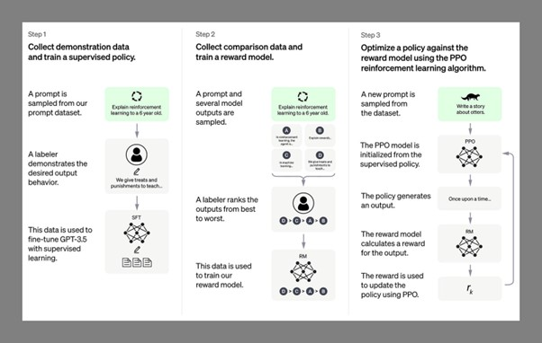
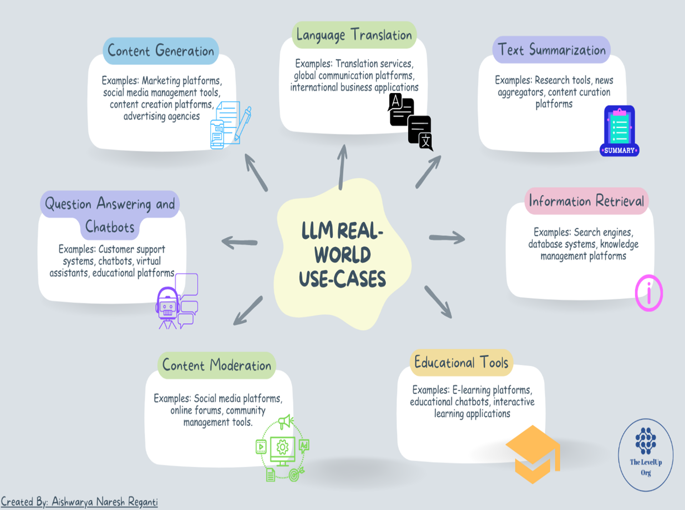
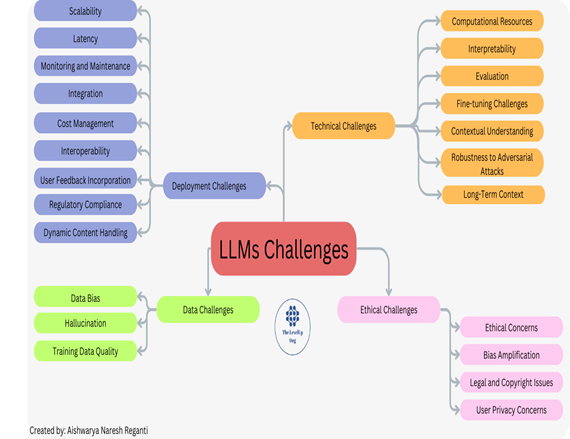

**Day 1: LLM Basics and Foundations**

1. **History and Background**
1. ## **LLMs**
1. ## **Training LLMs**
1. ## **The LLM Design and LLM Architecture**
1. ## **Working of LLM**
1. ## **Applications** 
1. ## **Challenges**
1. ## **How to Overcome the Challenges**
**History and Background**

The history and basic ideas behind artificial intelligence (AI) and machine learning (ML), which are like teaching computers to learn from examples without being told exactly what to do. Then, we explore neural networks, which are like computer systems inspired by the human brain, and generative AI, which is a type of AI that can create new things based on what it's learned.

One of the big things we focus on is Large Language Models (LLMs), which are these huge models that understand and generate text. They're called "large" because they're built with a lot of components and trained on tons of data, which helps them understand language really well. These models, like ChatGPT, can do all sorts of cool things with language, from answering questions to creating stories.

We also look at how these models have evolved over time, from simpler ones to these massive, powerful ones we have now. And we talk about the challenges of using them, like making sure they work quickly and accurately.
## **Enter LLMs**
Large Language Models (LLMs) like GPT-3, Gemini, and Claude are characterized by their massive scale, both in architecture size and training data volume. They possess thousands of billion model parameters, akin to knobs in machine learning algorithms, crucial for accurate predictions and meaningful outputs. LLMs are language models trained to understand and generate human-like text by learning from diverse datasets. Their large size enables them to capture complex language patterns effectively, unlike traditional smaller models.
## **Training LLMs**
Training Large Language Models (LLMs) involves exposing the model to extensive text data from various sources like books, articles, and websites. During training, the model learns to predict the next word or token in a sequence based on context, fine-tuning its weights to minimize error rates and improve accuracy. This process involves continuously adjusting parameter values based on error feedback received during predictions.

LLM performance is influenced by model architecture and the quality and diversity of the dataset used for training. Training a private LLM requires substantial computational resources and expertise, typically involving cloud-based solutions and high-performance GPUs to expedite the process. After initial training, LLMs can be customized for various tasks using fine-tuning techniques, including zero-shot learning, few-shot learning, and domain adaptation.

Zero-shot learning allows LLMs to handle a wide range of requests without explicit training, often using prompts. Few-shot learning improves performance in specific domains by providing a small number of training examples, while domain adaptation adjusts the model's parameters using additional relevant data. These techniques will be explored further in the course.
## **The LLM Design and LLM Architecture**
In the context of Large Language Models (LLMs), "architecture" refers to the blueprint of the neural network, dictating how neurons are organized and connected to process information and generate outputs. Core components include layers, neurons, activation functions, and the transformer architecture, which enables advanced language modeling through self-attention. Architecture sophistication is determined by depth, width, and parameter tuning.

"Design" focuses on how to best utilize the model, encompassing hyperparameters, data pipelines, and resource allocation. It ensures operational efficiency and user-friendliness, harnessing the model's intellectual prowess for scalable and effective language processing.
## **Working of LLM**
##

In the realm of Large Language Models (LLMs), a multi-step approach is employed to optimize their effectiveness. Initially, LLMs undergo unsupervised learning, comprehending vast amounts of unlabeled data to grasp relationships between words and concepts. This is followed by semi-supervised learning, where labeled data enhances the model's accuracy further.

Next, LLMs utilize transformer neural networks to better understand word and idea relationships. The self-attention mechanism within transformers aids in determining the significance of each word or token in a given context.

Once fully trained, LLMs are capable of practical applications like text generation, summarization, sentiment analysis, and question answering, making them valuable for various real-world tasks.
## **Applications**
##

## **Challenges**
##

## **How to Overcome the Challenges**
Overcoming challenges in Large Language Models (LLMs) involves strategic approaches to ensure their effectiveness and ethical deployment. Firstly, refining data quality and specificity is crucial, as high-quality, domain-specific datasets enhance model performance. Fine-tuning pre-trained LLMs on specific tasks or domains through transfer learning further optimizes accuracy and relevance. Enhancing model interpretability through visualization techniques and attention mechanisms helps understand decision-making processes and identify biases.

Resource efficiency is essential, achieved through architecture optimization and deployment strategies, including model compression and lightweight variants. Addressing ethical concerns like bias and privacy requires fairness-aware training and privacy-preserving methods. Regulatory compliance is key, necessitating adherence to data protection laws and industry standards.

Collaborative development fosters interdisciplinary discussions and validation against real-world requirements, ensuring LLMs meet stakeholder needs. By implementing these strategies, organizations can harness the power of LLMs while mitigating challenges for successful deployment and impactful use across various domains.
## **GENERATIVE AI**
## **Generative AI Overview:**
Generative AI enables the rapid generation of new content across various modalities, such as text, images, audio, and more, based on input data. This technology leverages neural networks to discern patterns within existing data and produce novel content. By employing learning approaches like unsupervised or semi-supervised learning, generative AI models can utilize unlabeled data for training. The outputs generated by these models can be diverse and highly creative, opening up numerous possibilities for applications across industries and domains. Generative AI is revolutionizing content creation, exploration, and automation, making it a crucial area of focus in AI research and development.

**Working Principle:**

Generative AI models operate by using neural networks to analyze patterns and structures within existing data, enabling them to generate new and original content across various modalities. These models are trained on large datasets using learning approaches like unsupervised or semi-supervised learning. During training, the model learns to capture the underlying distribution of the input data, allowing it to produce outputs that resemble the training data while also exhibiting creativity and novelty. Depending on the specific architecture and training method, generative AI models can generate diverse outputs, ranging from text, images, and audio to more complex data types like 3D models and animations.

**Foundation Models and Examples:**

1. GPT-3 (Generative Pre-trained Transformer 3): Developed by OpenAI, GPT-3 is one of the largest and most powerful language models to date. It consists of 175 billion parameters and has been trained on a diverse range of internet text. GPT-3 excels at natural language understanding and generation tasks, including text completion, translation, summarization, and question answering.
1. Stable Diffusion: Stable Diffusion is a generative model that focuses on creating photorealistic images given a text input. It leverages diffusion models to generate high-quality images that closely resemble natural photographs. This model is particularly useful for tasks such as image synthesis, style transfer, and content creation.

**Evaluation Criteria:**

Quality, diversity, and speed are key requirements for successful generative AI models. High-quality outputs, diverse content generation, and fast processing are essential for effective utilization in various applications.

**Development Approaches:**

1. **Diffusion Models:** Also known as denoising diffusion probabilistic models (DDPMs), diffusion models utilize a two-step process during training: forward diffusion and reverse diffusion. This process involves gradually adding random noise to training data and then reversing the noise to reconstruct the original data samples. Diffusion models can generate high-quality outputs and are flexible for generalized use cases.
1. **Variational Autoencoders (VAEs):** VAEs consist of two neural networks: an encoder and a decoder. The encoder compresses input data into a smaller, dense representation, while the decoder reconstructs the original data from the compressed representation. VAEs are efficient for generating outputs such as images, but the quality may not be as high as diffusion models.
1. **Generative Adversarial Networks (GANs):** GANs comprise a generator and a discriminator network, trained adversarially to generate realistic outputs. The generator creates new examples, while the discriminator distinguishes between real and generated content. GANs excel at producing high-quality samples but may lack diversity in the generated outputs.

**Applications Across Industries:**

- Language: Large Language Models (LLMs) like GPT-3 are used for tasks such as essay generation, code development, translation, and understanding genetic sequences. These models can generate coherent and contextually relevant text based on input prompts.
- Audio: Generative AI is employed in music composition, speech synthesis, and audio generation. It can create songs, snippets of audio clips, and even recognize objects in videos and generate accompanying sounds.
- Visual: In the visual domain, generative AI is used to generate 3D images, avatars, videos, graphs, and illustrations. It can create realistic images for virtual or augmented reality, produce 3D models for video games, and enhance or edit existing images.
- Synthetic Data: Generative models generate synthetic data to train AI models when real data is limited or unavailable. This is particularly useful in industries like healthcare, where synthetic data aids in medical research and drug discovery, and in autonomous vehicles, where it helps in training and testing without real-world data.
- Entertainment: Generative AI enhances content creation in industries such as gaming, film, animation, and virtual reality. It assists in world building, character design, and creating immersive experiences for users.

**Challenges and Solutions:**

Challenges in generative AI stem from the demanding computational requirements, including substantial infrastructure and processing power, leading to high costs and technical complexities. Moreover, the sampling speed of generative models can be hindered by their complexity, impacting real-time applications. Limited availability of high-quality data presents another obstacle, requiring innovative solutions like data augmentation and transfer learning to overcome data scarcity. Additionally, navigating data licensing issues poses legal and intellectual property challenges, necessitating collaborative partnerships and strategic negotiations. Despite these challenges, cloud-based solutions, algorithm optimization, data augmentation techniques, and collaborative efforts offer promising avenues for addressing the complexities of generative AI and unlocking its full potential across various domains.

##
##
##

##
##

##
##

