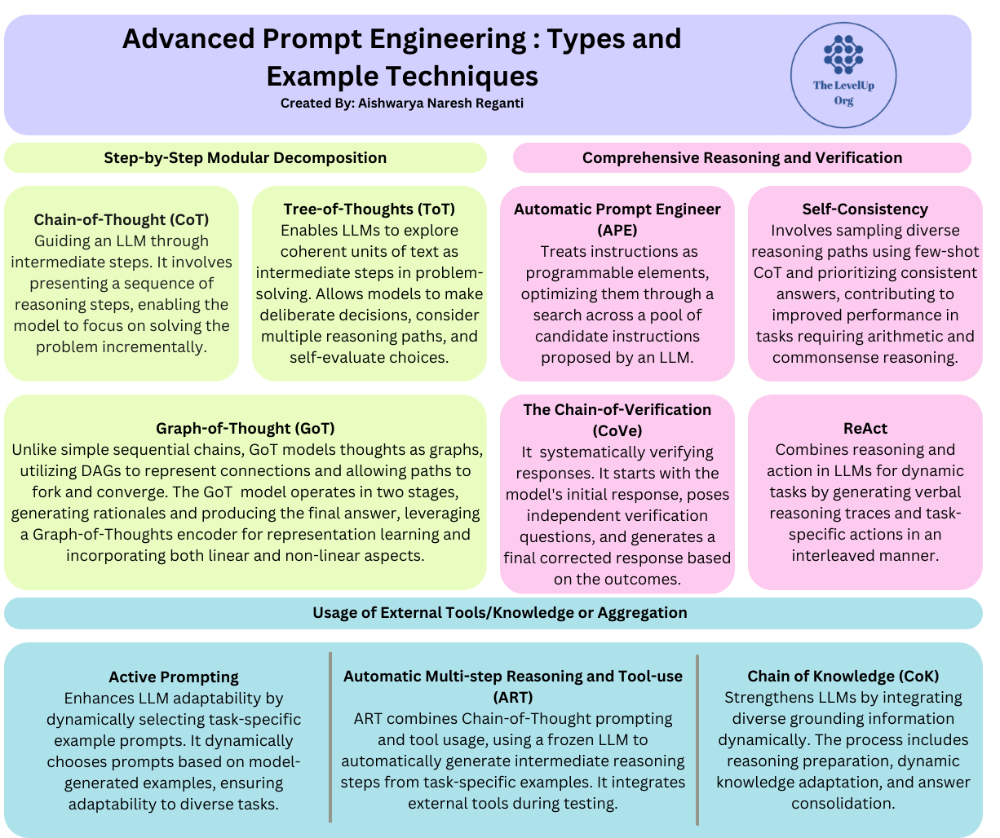

## **Advanced Prompt Engineering Techniques**

Advanced Prompt Engineering Techniques are a set of methods for improving the performance of large language models on complex tasks. These techniques involve providing the LLM with more informative and structured prompts, as well as using prior knowledge and logical reasoning to guide the LLM's responses.

## **Step-by-Step Modular Decomposition**

These methods involve breaking down complex problems into smaller, manageable steps, facilitating a structured approach to problem-solving. These methods guide the LLM through a sequence of intermediate steps, allowing it to focus on solving one step at a time rather than tackling the entire problem in a single step. This approach enhances the reasoning abilities of LLMs and is particularly useful for tasks requiring multi-step thinking.

#### Examples of methods falling under this category include:
#### 1.Chain-of-Thought (CoT) Prompting
#### 2.Tree-of-Thoughts (ToT) Prompting
#### 3.Graph of Thought Prompting

## **Chain of Thought Prompting**
Chain of thought (CoT) prompting1 is a recent advancement in prompting methods that encourage Large Language Models (LLMs) to explain their reasoning. This method contrasts with standard prompting by not only seeking an answer but also requiring the model to explain its steps to arrive at that answer.

## 1a.Zero-shot/Few-Shot CoT Prompting
Zero-Shot Chain-of-Thought prompting is a technique that involves appending the words "Let's think step by step" to the end of a question to guide language models in generating a chain of thought that leads to more accurate answers. This method aims to improve AI responses by incorporating step-by-step reasoning without the need for multiple input exemplars, unlike traditional Chain-of-Thought prompting

## 1b.Automatic Chain-of-Thought (Auto-CoT)
Automatic Chain-of-Thought (Auto-CoT) is a technique that aims to eliminate the manual effort required in designing effective Chain-of-Thought (CoT) prompts for large language models (LLMs)
**The key aspects of Auto-CoT are:**
##### Question Clustering: 
The method first partitions the questions in a given dataset into a few clusters based on their characteristics, such as length and complexity
###### Demonstration Sampling: 
From each cluster, Auto-CoT selects a representative question and generates its reasoning chain using Zero-Shot CoT prompting. This generates a diverse set of demonstrations to prompt the LLM
##### Automatic Prompt Generation: 
The diverse demonstrations are then used to automatically construct the final CoT prompt, without the need for manual design

## **Tree-of-Thoughts (ToT) Prompting**
Tree of Thoughts prompting enables AI models to parallelly explore multiple paths. The model can backtrack the input and self-evaluate choices to find the next course of action. Therefore, instead of generating a single output, it deliberately plans and explores multiple solutions and suggests the best outcome.

## **Graph of Thought Prompting**
The "Graph of Thoughts" technique is a pioneering approach in the realm of Large Language Models (LLMs), aimed at empower AI with more flexible and human-like problem-solving capabilities. As AI continues to  penetrate into various aspects of daily life, there's a growing need for models that don't just understand or generate text, but can think, reason, and solve problems like a human. This technique represents a leap forward in this direction, using the concept of a graph to represent and manipulate knowledge in a dynamic and flexible manner.

