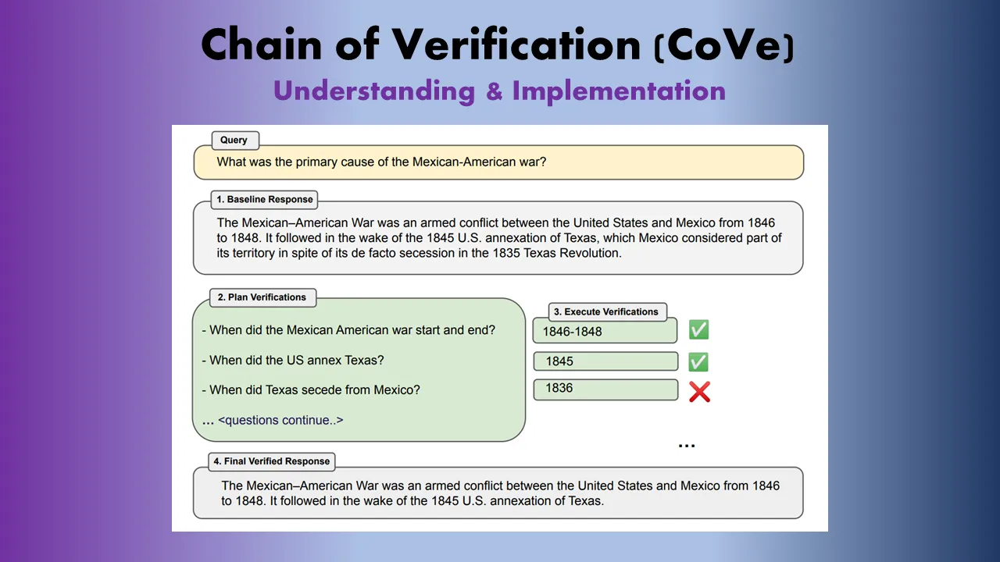
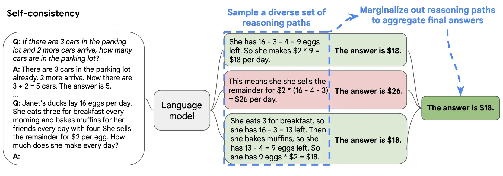
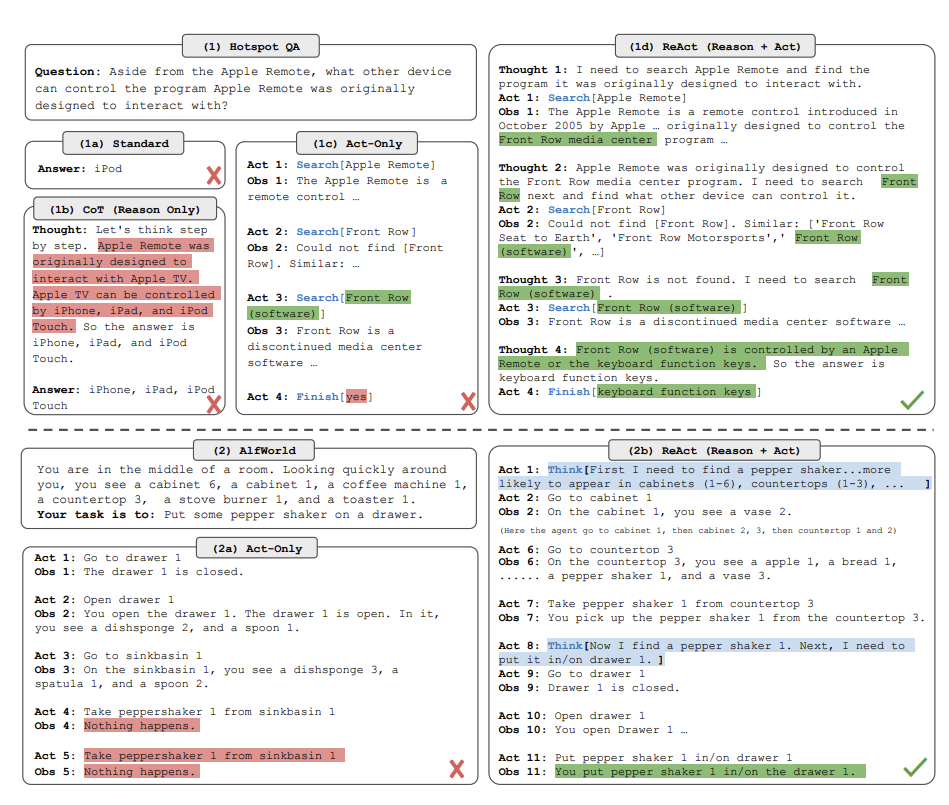

## **Comprehensive Reasoning and Verification**

Comprehensive reasoning and verification methods in prompting mean that when a system is asked a question, it doesn't just give a simple answer. Instead, it breaks down the process of finding the answer into smaller steps and shows these steps to ensure they make sense.

It's like a teacher explaining a math problem step by step rather than just giving the final answer. But here's the cool part: the system checks its own work to make sure each step is correct. If it finds a mistake, it corrects itself and tries again. This self-checking and correcting process helps the system get better at reasoning and gives more reliable answers over time.

## **Automatic Prompt Engineer**

Automatic Prompt Engineering (APE) is a technique that aims to automate the process of generating high-quality prompts for large language models (LLMs)
**The key aspects of APE are:**

**Prompt Generation:** APE uses LLMs to generate a pool of candidate prompts, either through direct inference or a recursive process based on semantic similarity
**Prompt Evaluation:** The generated prompts are then executed using the target LLM, and the most appropriate prompt is selected based on computed evaluation scores
**Iterative Refinement:** APE can iteratively refine the prompts to improve their quality and performance on the target task

## **Chain of Verification (CoVe)**
The Chain of Verification (CoVe) method is designed to enhance the reliability of answers provided by Large Language Models, particularly in factual question and answering scenarios, by systematically verifying and refining responses to minimize inaccuracies.This self-verification process is employed to assess the accuracy of the initial response and refine it for greater precision. Achieving this relies on skillfully crafting and sequencing LLM prompts.

## **Self Consistency**

Self-Consistency is a technique that allows a language model to generate multiple thought chains and then select the most consistent answer as the final result. This technique is complementary to Chain of Thought, which prompts the model to produce a series of short sentences that mimic a human's reasoning process.When a language model is prompted with a question, it first generates a number of different thought chains. Each thought chain is a possible solution to the question. The model then evaluates each thought chain and selects the one that is most consistent with the evidence.

## **ReACT**
ReAct Prompting revolutionizes AI communication by leveraging urgency, specificity, and curiosity, thereby enhancing the precision and relevance of AI responses.This method improves user experience by making interactions with AI feel more natural and intuitive, resembling a conversation rather than a simple command-response dynamic.Practical applications of ReAct Prompting span across customer service, education, content creation, and research, showcasing its versatility and potential to transform various fields.Despite its promise, ReAct Prompting faces challenges such as the need for deep understanding of prompt crafting, AI limitations, scalability issues, privacy concerns, and the necessity to keep pace with AI advancements.The future of prompt engineering with ReAct Prompting looks bright, with implications for more personalized, efficient, and contextually aware AI communications across diverse sectors.

