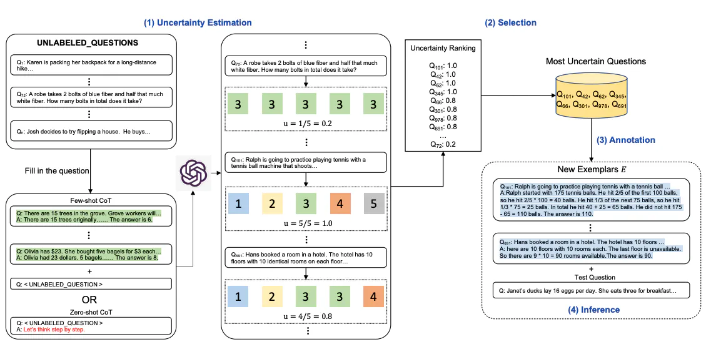
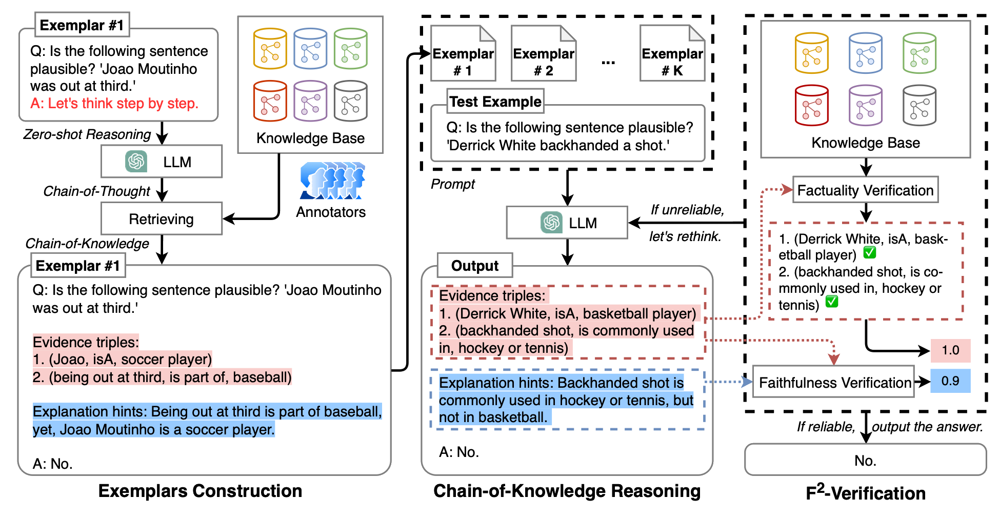

## **Usage of External Tools/Knowledge or Aggregation**
This category of prompting methods uses outside sources or tools to help Large Language Models (LLMs) perform better. They understand that having access to more information can help LLMs give better answers. These methods also use aggregation, which means combining multiple responses to make the answers stronger. They know that different ways of thinking can lead to better and more complete answers. So, by bringing together different perspectives, these methods help LLMs give more reliable and thorough responses.

## **Active Prompting (Aggregation)**
Active Prompting (Aggregation) is a method used to improve the performance of Large Language Models (LLMs) by dynamically selecting task-specific example prompts. Unlike fixed sets of exemplars used in Chain-of-Thought methods, Active Prompting adapts to diverse tasks effectively. Here's how it works:

**Dynamic Querying:** The LLM is queried with or without existing examples for a set of training questions, generating multiple possible answers, thus introducing uncertainty.\
**Uncertainty Metric:** An uncertainty metric is calculated based on the disagreement among the generated answers, reflecting the model's uncertainty about the best response.\
**Selective Annotation:** Questions with the highest uncertainty are chosen for human annotation. Humans provide new annotated exemplars tailored to address the model's uncertainties.\
**Adaptive Learning:** The newly annotated exemplars are integrated into the training data, enriching the model's understanding for those specific questions. The model learns from these examples, adjusting its responses accordingly.

## **Automatic Multi-step Reasoning and Tool-use (ART) (External Tools)**
Automatic Multi-step Reasoning and Tool-use (ART) in prompt engineering is a method that involves using external tools or resources to help Large Language Models (LLMs) reason through complex problems or tasks that require multiple steps. Here's a simplified explanation:

**Multi-step Reasoning:** Instead of just providing a single answer to a question, ART enables LLMs to break down complex tasks into smaller, manageable steps. This helps the model tackle difficult problems by considering each step separately.\
**Tool-use:** ART allows LLMs to access external tools or resources that can assist in the reasoning process. These tools might include databases, APIs, or specialized software that provide additional information or functionality needed to solve the task.\
**Integration:** The LLM integrates the information or assistance obtained from the external tools into its reasoning process. This can involve using the data retrieved from external sources to support its arguments, validate its conclusions, or perform specific tasks required by the prompt.\
**Enhanced Performance:** By leveraging external tools and performing multi-step reasoning, ART enables LLMs to provide more comprehensive, accurate, and contextually relevant responses to complex prompts. This enhances the overall performance and utility of the model in various applications.

## **Chain-of-Knowledge (CoK)**
Chain-of-Knowledge (CoK) prompting is a way of teaching AI models by guiding them through a series of related facts or ideas, one step at a time. Each new prompt builds on what the model already knows, helping it understand the topic better. This method helps the AI to combine information from different sources and improve how well it can answer questions or solve problems. So, CoK prompting helps AI models learn better and give smarter answers.
**Knowledge Chain:** CoK prompting involves structuring prompts in such a way that they lead the model through a sequence of related facts, concepts, or ideas. Each prompt builds upon the previous one, creating a logical chain of information.\
**Comprehensive Understanding:** By presenting information in a sequential manner, CoK prompting encourages the model to develop a comprehensive understanding of the topic or task at hand. This sequential approach helps guide the model's reasoning process and ensures that it considers relevant context when generating responses.\
**Integration of Knowledge:** CoK prompting enables the model to integrate knowledge from multiple sources or domains. As it progresses through the chain of prompts, the model can incorporate information from previous steps to inform its responses, leading to more coherent and contextually relevant outputs.

