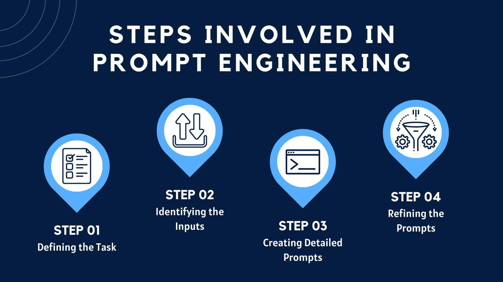
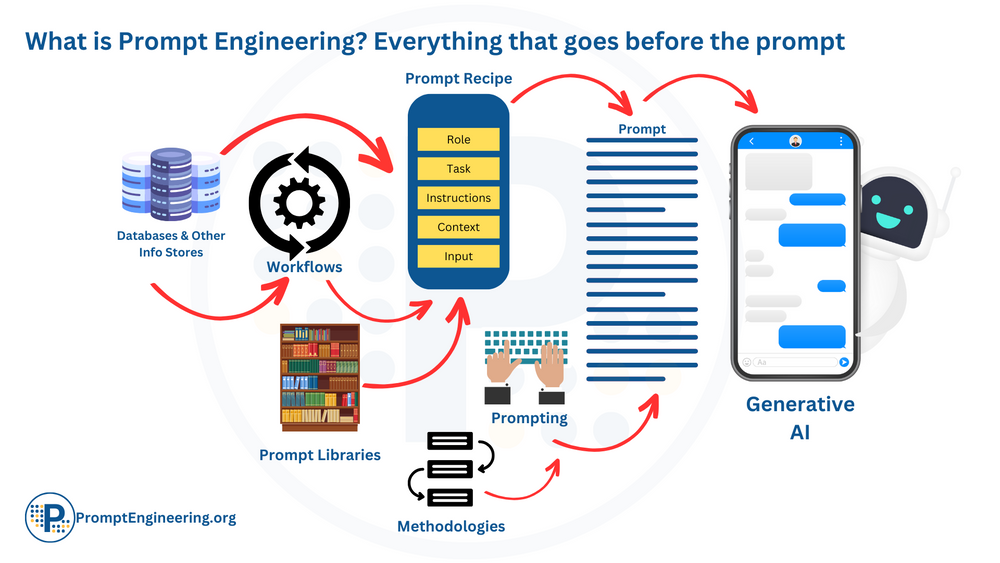

# **Day 2: Prompting for LLMs**
## **Prompt Engineering**

Prompt engineering is a dynamic and essential practice within the burgeoning field of AI, particularly in refining prompts to optimize language models (LLMs) for various applications. It enhances LLM performance across tasks like question answering and arithmetic reasoning. This skill set goes beyond prompt design, encompassing a deep understanding of LLM capabilities, safety considerations, and integrating domain knowledge. Prompt engineering ensures AI behavior aligns with human intent and is not limited to specialists; anyone refining prompts for LLMs contributes to this crucial practice, making it accessible to all users.

## **Why Prompting?**
### Contextual Understanding: 
LLMs are trained to understand context, so structuring prompts appropriately ensures relevant associations and coherent responses.

### Training Data Patterns: 
Effective prompts align with the language and structures the model learned from its training data, enabling consistent responses.

### Transfer Learning: 
Well-crafted prompts bridge the general knowledge from training to specific tasks, facilitating transfer learning.

### Contextual Prompts for Contextual Responses: 
Using prompts resembling the model's training language and context leads to more accurate and appropriate responses.

### Mitigating Bias: 
Thoughtful prompts can mitigate biases inherited from training data, promoting ethical and unbiased responses.

Prompting is collaborative, guiding models to produce useful, relevant, and policy-compliant outputs. Adversarial prompting, a growing field, intentionally exploits model weaknesses, posing challenges in safeguarding against harmful or misleading responses. Addressing these challenges is crucial for ensuring model reliability and ethical use.

Here's an example prompt for a text classification task:

## Prompt:

#### Classify the text into neutral, negative, or positive
#### Text: I think the food was okay.
#### Sentiment:

In this example:

#### Instruction: "Classify the text into neutral, negative, or positive."
#### Input Data: "I think the food was okay."
#### Output Indicator: "Sentiment."

Note that this example doesn't explicitly use context, but context can also be incorporated into the prompt to provide additional information that aids the model in understanding the task better.

It's important to highlight that not all four elements are always necessary for a prompt, and the format can vary based on the specific task. The key is to structure prompts in a way that effectively communicates the user's intent and guides the model to produce relevant and accurate responses.

## Steps in Prompt Engineering

## **OpenAI's guidelines on prompt engineering emphasize several key points:**

**Use the Latest Model:** 
Optimal results are achieved by utilizing the most recent and capable models available.
**Structure Instructions:** 
Clearly separate instructions from context using ### or """ for improved clarity and effectiveness.
**Be Specific and Descriptive:** 
Clearly articulate the desired context, outcome, length, format, and style in a specific and detailed manner.
**Specify Output Format with Examples:** 
Express the desired output format through examples, facilitating accurate model understanding and response.
**Use Zero-shot, Few-shot, and Fine-tune Approach:** 
Start with zero-shot, then few-shot, and if needed, fine-tune the model for better performance.
**Avoid Fluffy Descriptions:** 
Minimize vague and imprecise descriptions, opting for clear instructions and avoiding unnecessary verbosity.
**Provide Positive Guidance:** 
Offer clear instructions on desired actions rather than focusing on what not to do, providing positive guidance.
**Code Generation Specific - Use "Leading Words":** 
In code generation tasks, utilize "leading words" to guide the model towards specific patterns or language, enhancing code generation accuracy.

## **Promting**

