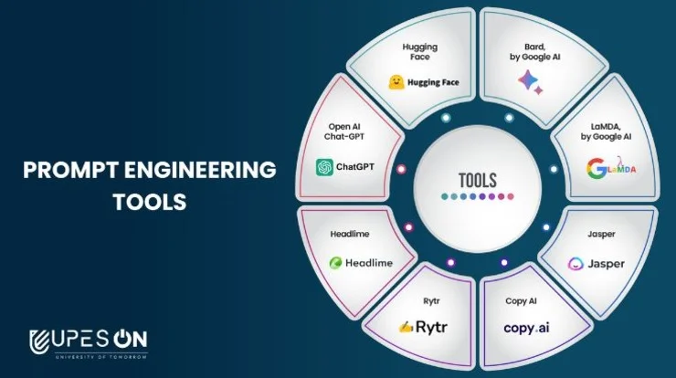

## **Tools of prompt Engineerring**

## **Applications of Prompt Engineering**

### Content Creation
Prompt engineering allows for the generation of content tailored to specific styles, tones, or themes, benefiting fields like journalism, creative writing, and marketing. By providing detailed prompts, AI can assist in generating novel ideas, storylines, or visual content, aiding creators in overcoming creative blocks. 

### Customer Service
AI-powered customer service benefits from prompt engineering by providing quick, accurate responses to customer inquiries. Tailored prompts can guide AI to offer personalized responses based on customer history or specific needs, enhancing the overall customer service experience. 

### Education and Training
Prompt engineering in education enables AI to generate customized learning materials tailored to the curriculum, difficulty level, or learning style of students. Interactive AI tutors can adapt to student responses, providing personalized feedback and support, thereby making learning more accessible and engaging. 

### Research
In academic and industrial research, prompt engineering enables AI to process and analyze large datasets, uncovering patterns or correlations that might be missed by human researchers. AI can assist in conducting comprehensive literature reviews, summarizing findings, and suggesting potential gaps in research. 

### Healthcare
Prompt engineering facilitates the development of AI tools that assist healthcare professionals in diagnosing diseases by analyzing symptoms and medical data. AI can also provide preliminary mental health support through personalized conversations and exercises based on well-crafted prompts. 

### Legal and Compliance
In legal and compliance tasks, prompt engineering allows AI to review legal documents for compliance, discrepancies, or specific legal terms, reducing the workload on human lawyers.

### Business Intelligence and Analytics
Prompt engineering supports business intelligence and analytics by providing insights into market trends, consumer behavior, and competitive analysis. Companies can use AI-driven insights to make informed decisions and optimize business strategies. 

