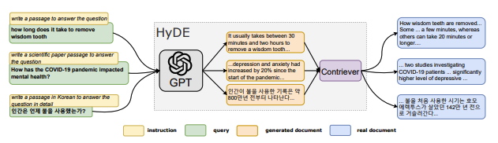

## **Improving RAG components**

### **Improving RAG components (Ingestion)**
**Better Chunking Strategies**
* Content-Based Chunking: Breaks down text based on meaning and sentence structure, preserving coherence but requiring additional computational resources.
* Sentence Chunking: Divides text into complete sentences, maintaining unity but resulting in chunks of varying sizes.
* Recursive Chunking: Splits text into hierarchical chunks, offering granularity but increasing complexity in management and indexing.

**Better Indexing Strategies**
* Detailed Indexing: Assigns identifiers and feature vectors to chunks based on sub-parts, providing specific context but demanding more memory and processing time.
* Question-Based Indexing: Categorizes chunks based on knowledge domains and relevance to user requests, enhancing efficiency but potentially leading to information loss.
* Optimized Indexing with Chunk Summaries: Generates summaries for chunks and assigns identifiers and feature vectors based on similarity, providing synthesis and variety but requiring complexity in summary generation and comparison.

### **Improving RAG components (Retrieval)**
**1.Hypothetical Questions and HyDE**\
Hypothetical questions are generated for each chunk of text and used for search, enhancing search quality by matching queries with hypothetical questions.HyDE involves generating hypothetical responses given a query, leveraging the query's vector representation for better search quality.

**2.Context Enrichment:**
* Sentence Window Retrieval: Retrieve a single sentence and extend the context by including surrounding sentences, enhancing the understanding of context for generating responses.
* Auto-Merging Retriever: Merge smaller chunks into larger ones to capture both granularity and context for more comprehensive responses.
 
**3.Fusion Retrieval or Hybrid Search:**
Integrates traditional keyword-based search with semantic search techniques to improve search outcomes by combining both relevance and keyword matching.

**4.Reranking & Filtering:**
Refine retrieved results through filtering, reranking, or transformations before presenting them to the model for response generation.

**5.Query Transformations and Routing**
* Query Expansion: Break down complex queries into sub-questions for narrower retrieval challenges.
* Query Re-writing: Rephrase poorly framed queries to improve retrieval effectiveness.
* Query Compression: Condense chat history into a final question for retrieval.
* Dynamic Query Routing: Efficiently direct queries to appropriate data sources, adapting to different sources for optimized retrieval.

### **Improving RAG components (Generation)**
**Response Synthesis Approaches:**
* Iterative Refinement: Refine the answer by sending retrieved context to the Language Model chunk by chunk.
* Summarization: Summarize the retrieved context to fit into the prompt and generate a concise answer.
* Multiple Answers and Concatenation: Generate multiple answers based on different context chunks and then concatenate or summarize them.

**Encoder and LLM Fine-Tuning:**
* Encoder Fine-Tuning: Fine-tune the Transformer Encoder for better embeddings quality and context retrieval.
* Ranker Fine-Tuning: Use a cross-encoder for reranking retrieved results, especially if there's a lack of trust in the base Encoder.
* RA-DIT Technique: Use a technique like RA-DIT to tune both the LLM and the Retriever on triplets of query, context, and answer.
