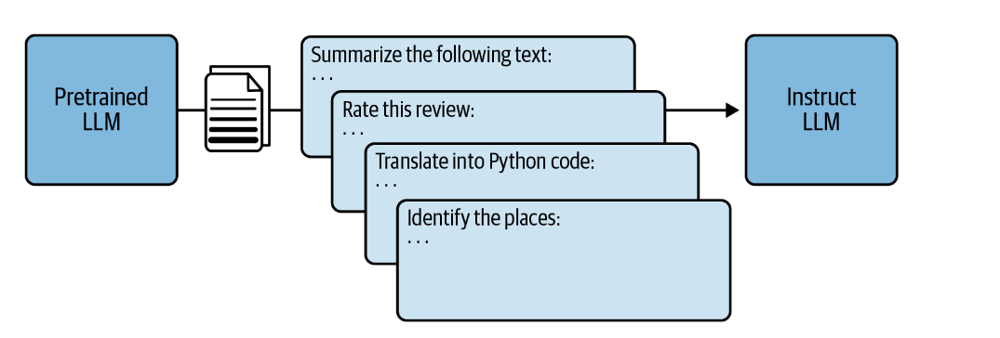
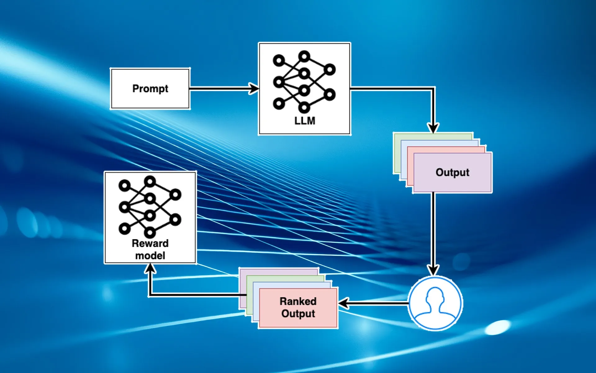
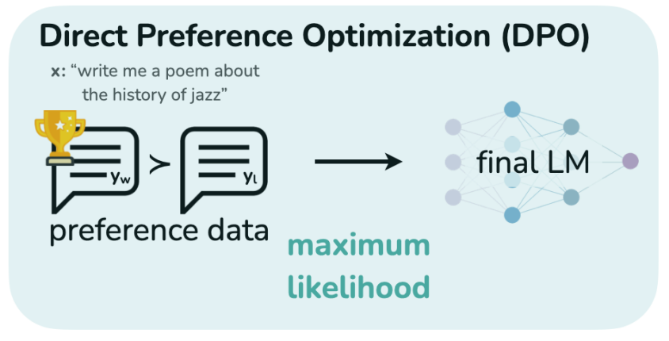
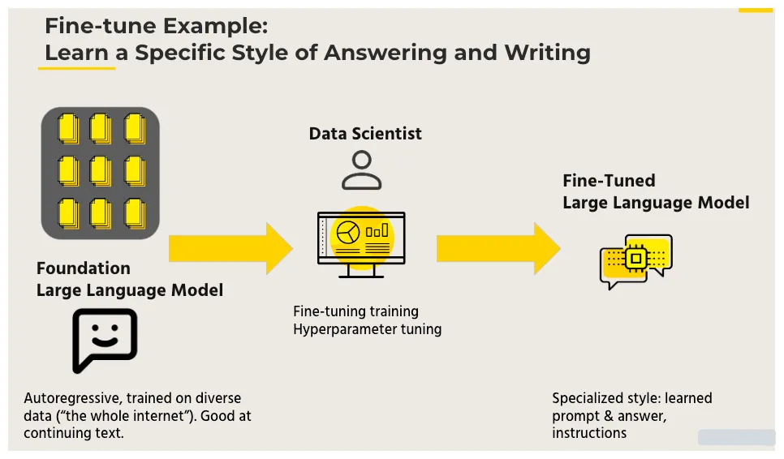

## **Day 4: LLM Fine-Tuning**
### **Introduction**
* Fine-tuning is like giving a head start to a model and then customizing it to do a specific job better. Imagine you have a really smart friend who knows a lot about many things but needs a bit of help to understand something new. You can teach them about that new thing, making them even better at it.

* For example, think about using a super smart computer program called GPT-3 to help doctors write patient reports. GPT-3 knows a lot about general stuff, but it might not understand all the fancy medical words and phrases. So, you can give it some special training with medical notes and reports. This way, it gets better at understanding medical language and writing reports accurately.

* It's not just for words though. Let's say you have a computer program that's really good at spotting cars in pictures. But when you want it to spot trucks instead, it might not be as good. So, you can fine-tune it by showing it lots of pictures of trucks until it gets better at recognizing them.

* Basically, fine-tuning is about taking a smart program, giving it some extra training on specific things, and making it even smarter for those particular tasks.
### **Why Fine-Tuning?**
Fine-tuning is like giving a super smart model extra training to make it really good at a specific job. Think of it like this: you have a friend who knows a lot about many things but needs a bit of help to understand something new. You teach them about that new thing until they're really good at it. Now, why do we need to do this with smart computer programs? Well, these programs, called large language models, are designed to be good at lots of tasks, but not necessarily great at one specific thing. So, we fine-tune them to be exceptional at a particular job.

Here's why we do it:

* Custom Fit: We want the model to be perfect for the job it's doing, not just okay.
* Matching Data: Sometimes, the model needs to understand a specific type of information that it wasn't trained on before, so we fine-tune it to learn that new stuff.
* Saving Time and Money: Instead of starting from scratch, which can be really expensive and take a long time, we use what the model already knows and just tweak it a bit.
* Handling Different Situations: Sometimes, the model might not understand things that are a bit different from what it's used to. Fine-tuning helps it get better at handling these differences.
* Sharing Knowledge: The model already knows a lot of general things. Fine-tuning helps it use that knowledge for specific tasks.
* Making Users Happy: We want the model to work just the way users want it to, so we fine-tune it to match their needs.
* Staying Up-to-Date: Things change over time, so we fine-tune the model to keep it relevant and useful.

In simple terms, fine-tuning makes smart computer programs even smarter for the jobs they're meant to do, helping them understand specific things better and work more effectively in the real world.

### **Types of Fine-Tuning**
At a basic level, fine-tuning methods for language models fall into two main types: supervised and unsupervised. In supervised methods, the model learns from labeled data, where each example has a clear desired outcome. Unsupervised methods, however, work with unlabeled data, aiming to uncover patterns and structures without explicit labels.

#### **Unsupervised Fine-Tuning Methods:**

**Unsupervised Full Fine-Tuning:**
This method updates a language model's knowledge base without altering its existing behavior. For example, if the aim is to refine the model with legal literature or adapt it to a new language, an unstructured dataset of legal documents or texts in the target language is used. This allows the model to improve its understanding and adapt to the nuances of legal language without labeled examples, showcasing the versatility of unsupervised fine-tuning.

**Contrastive Learning:**
Contrastive learning focuses on training the model to differentiate between similar and dissimilar examples in the latent space. By encouraging the model to group similar examples together while separating dissimilar ones, it learns to capture subtle relationships and differences in the data. This technique is valuable for tasks requiring fine-grained discrimination, enhancing language models for specific applications.
* Instruction Fine-Tuning

#### **supervised Fine-Tuning Methods:**
In this method, the model is trained on a task-specific labeled dataset, where each input data point is associated with a correct answer or label. The model learns to adjust its parameters to predict these labels as accurately as possible. This process guides the model to apply its pre-existing knowledge, gained from pre-training on a large dataset, to the specific task at hand. Supervised fine-tuning can significantly improve the model's performance on the task, making it an effective and efficient method for customizing LLMs.

The most common supervised fine-tuning techniques are:

**Basic hyperparameter tuning**
Basic hyperparameter tuning is a simple approach that involves manually adjusting the model hyperparameters, such as the learning rate, batch size, and the number of epochs, until you achieve the desired performance.The goal is to find the set of hyperparameters that allows the model to learn most effectively from the data, balancing the trade-off between learning speed and the risk of overfitting. Optimal hyperparameters can significantly enhance the model's performance on the specific task.
**Transfer learning**
Transfer learning is a powerful technique that’s particularly beneficial when dealing with limited task-specific data. In this approach, a model pre-trained on a large, general dataset is used as a starting point.The model is then fine-tuned on the task-specific data, allowing it to adapt its pre-existing knowledge to the new task. This process significantly reduces the amount of data and training time required and often leads to superior performance compared to training a model from scratch.
**Multi-task learning**
In multi-task learning, the model is fine-tuned on multiple related tasks simultaneously. The idea is to leverage the commonalities and differences across these tasks to improve the model's performance. The model can develop a more robust and generalized understanding of the data by learning to perform multiple tasks simultaneously.This approach leads to improved performance, especially when the tasks it will perform are closely related or when there is limited data for individual tasks. 
**Few-shot learning**
Few-shot learning enables a model to adapt to a new task with little task-specific data. The idea is to leverage the vast knowledge model has already gained from pre-training to learn effectively from just a few examples of the new task. This approach is beneficial when the task-specific labeled data is scarce or expensive.In this technique, the model is given a few examples or "shots” during inference time to learn a new task. The idea behind few-shot learning is to guide the model's predictions by providing context and examples directly in the prompt.
**Task-specific fine-tuning**
This method allows the model to adapt its parameters to the nuances and requirements of the targeted task, thereby enhancing its performance and relevance to that particular domain. Task-specific fine-tuning is particularly valuable when you want to optimize the model's performance for a single, well-defined task, ensuring that the model excels in generating task-specific content with precision and accuracy.

#### **Instruction fine-tuning LLMs**
Instruction fine-tuning LLMs, also called chat or instruct models, are created by training pre-trained models with different types of instructions. Instruction fine-tuning can be defined as a type of supervised machine learning that improves the foundation model by continuously comparing the model’s output for a given input (e.g., instruction prompt with dialogue)  to the ground truth label (e.g., human baseline summary). The weights of the foundation LLM are updated accordingly based on the comparison. This process is continued for each instruction prompt.
For example, take a pre-trained LLM such as Llama-2-70b and train with specific instructions such as some of the following to create instruction fine-tuning LLM.

Summarize the following text: …
* Rate this review: …
* Translate into Python code: …
* Identify the places: …

The following image represents the same:

#### **Reinforcement Learning from Human Feedback (RLHF)**
Reinforcement learning from human feedback (RLHF) is a machine learning (ML) technique that uses human feedback to optimize ML models to self-learn more efficiently. Reinforcement learning (RL) techniques train software to make decisions that maximize rewards, making their outcomes more accurate. RLHF incorporates human feedback in the rewards function, so the ML model can perform tasks more aligned with human goals, wants, and needs. RLHF is used throughout generative artificial intelligence (generative AI) applications, including in large language models (LLM).

For fine-tuning large language models, reinforcement learning is recommended over supervised learning because it enables the model to learn from its own actions and modify its behavior accordingly rather than depending on pre-existing labeled data. Additionally, by integrating huge language models with human values and preferences, reinforcement learning can help reduce the dangers and misuse of those models

#### **Direct Policy Optimization (DPO)**
Direct Policy Optimization (DPO) is a reinforcement learning approach that focuses on optimizing the agent's policy directly based on environmental feedback. In DPO, the agent learns to navigate and interact with its environment, receiving feedback in the form of rewards or penalties. This feedback guides the agent's decision-making process, allowing it to learn and improve its policy over time. Unlike methods that rely on human-provided feedback, DPO does not require direct interaction with humans during training. Instead, the agent learns solely from its interactions with the environment, making it suitable for tasks where human intervention is not feasible or necessary. By directly optimizing the policy based on environmental feedback, DPO can be an effective approach for training agents to perform specific tasks or achieve desired objectives in various domains, such as robotics, gaming, or autonomous systems.

#### **DPO (Direct Policy Optimization) vs. RLHF (Reinforcement Learning from Human Feedback): Understanding the Differences**

| Aspect              | Direct Policy Optimization (DPO)                                     | Reinforcement Learning from Human Feedback (RLHF)                    |
|---------------------|-------------------------------------------------------------------------|----------------------------------------------------------------------|
| Training Signal     | Derived from environmental feedback (e.g., rewards)                     | Provided directly by human trainers (e.g., evaluations)              |
| Feedback Source     | Environment (simulation or real-world system)                           | Human trainers (domain experts or users)                            |
| Training Dynamics   | Direct optimization of policy based on environmental feedback           | Learning from human-provided feedback (e.g., imitation learning)     |
| Data Efficiency     | Can be data-efficient with informative environmental feedback           | Can be data-efficient with rich and accurate human feedback         |
| Human Interaction   | No direct human interaction required during training                    | Requires direct interaction with human trainers                     |
| Application Domain  | Commonly used in tasks where environmental feedback is informative     | Applied in domains where human expertise or preferences are crucial |
#### **Parameter-Efficient Fine-Tuning (PEFT)**
Parameter-Efficient Fine-Tuning (PEFT) is a method used in machine learning to fine-tune pre-trained models with minimal adjustments to their parameters. It's employed primarily in deep learning contexts, aiming to refine models efficiently while mitigating the risks of overfitting and reducing computational demands. PEFT typically starts with a pre-trained model, which has already learned general patterns from extensive training on a large dataset. Instead of adjusting all parameters during fine-tuning, PEFT selectively tunes only a subset while keeping the remaining parameters fixed. This selective approach helps preserve the knowledge learned during pre-training while adapting the model to a new task or domain. To prevent overfitting, PEFT often incorporates regularization techniques like weight decay or dropout. In some instances, task-specific layers are added on top of the pre-trained model and fine-tuned separately to capture task-specific features. 

#### **Additional**

[Finetuning-Large-Language-Models](https://www.turing.com/resources/finetuning-large-language-models)
