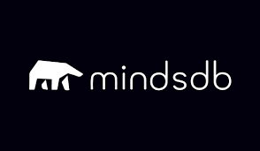

# **Llama 2**

Llama 2 is a family of pre-trained and fine-tuned large language models (LLMs) released by Meta AI in 2023. Released free of charge for research and commercial use, Llama 2 AI models are capable of a variety of natural language processing (NLP) tasks, from text generation to programming code.
# **Anthropic**

Anthropic PBC is a U.S.-based artificial intelligence startup company, founded in 2021, researching artificial intelligence as a public-benefit company to develop AI systems to “study their safety properties at the technological frontier” and use this research to deploy safe, reliable models for the public
# **Bloom AI**
Bloom AI is a smart tool for businesses that makes understanding data easier. It helps companies make better decisions by analyzing lots of information, almost like a person would.
# **Cohere**

Cohere is a Canadian multinational technology company focused on artificial intelligence for the enterprise, specializing in large language models.Using Cohere Embed, retailers can build tools to quickly segment and analyze customer feedback. Using Cohere models with retrieval-augmented generation (RAG), a luxury retailer built a virtual shopping assistant.
# **Crowdworks**
Crowdworks provides a service where they use AI to label data accurately. This labeled data helps businesses train their computer models better, so they can automate tasks more effectively. This means businesses can do more with less data, making their computer systems smarter.
# **BERT**

BERT is widely used in AI for language processing pre-training. For example, it can be used to discern context for better results in search queries. BERT outperforms many other architectures in a variety of token-level and sentence-level NLP tasks: Token-level task examples.
# **Lightning AI**
Lightning AI Studios is an all-in-one platform that unites different developer tools in one place users don't have to switch between different systems while developing AI models.
# **Falcon 180B**
Falcon 180B, being more advanced, excels in complex tasks that require deep reasoning, such as advanced research, coding, proficiency assessments, and knowledge testing. Its extensive training on diverse data sets also makes it a powerful tool for Gen-AI bot training.
# **OPT-175B**
"OPT-175B" does not appear to be a standard term or acronym with a widely recognized definition in common use. It might be a product code, an internal reference, or a specific designation used within a particular context or organization. Without more context, it's challenging to provide a precise definition. If you can provide additional information about where or how "OPT-175B" is used, I'd be happy to assist further in defining it.
# **MindsDB**

MindsDB is an open-source virtual database which automates pipelines that connect real-time data to AI systems. MindsDB adds two new building blocks to the data layer. Jobs which is a simple way to orchestrate real-time data tasks and AI Tables which connects real-time data to AI models.
