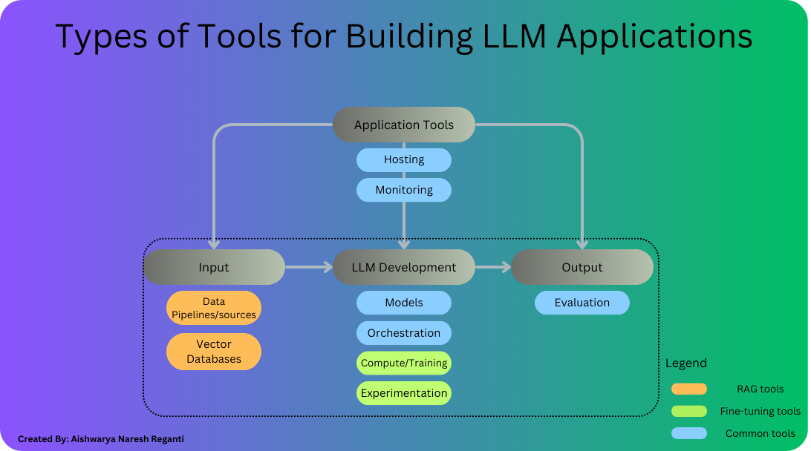
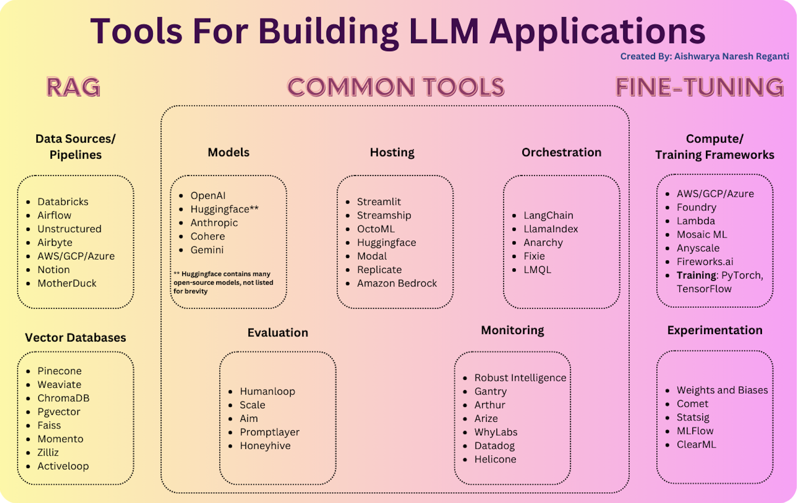

# **Day-5 Tools for Building LLM Applications**
## **Types of LLM Applications**

**Custom model adaptation**
Custom model adaptation involves both creating new models from scratch and fine-tuning existing models. While developing custom models requires skilled ML scientists and significant resources, fine-tuning involves updating pre-trained models with new data. Fine-tuning is becoming more accessible due to open-source innovations but still requires a proficient team and may have unintended consequences. Despite challenges, both approaches are being rapidly adopted across industries.

**Retrieval Augmented Generation (RAG)**
Retrieval Augmented Generation (RAG) is a method that helps models understand context better. It does this by getting word or phrase representations from special databases and using them to improve how the model works. This method makes it easier for models to understand what you're asking and give you useful answers without needing lots of training or customization. It's also cost-effective, flexible, and works well with different types of data.

## **Types of Tools**
* Input Processing Tools
* LLM Development Tools 
* Output Tools
* Application Tools 

RAG operates, an application typically follows these steps:

* Receives a query from the user (user's input to the application).
* Utilizes an embedding search to find pertinent data (this involves an embedding LLM, data sources and a vector database for storing data embeddings).
* Forwards the retrieved documents along with the query to the LLM for processing.
* Delivers the LLM's output back to the user.

